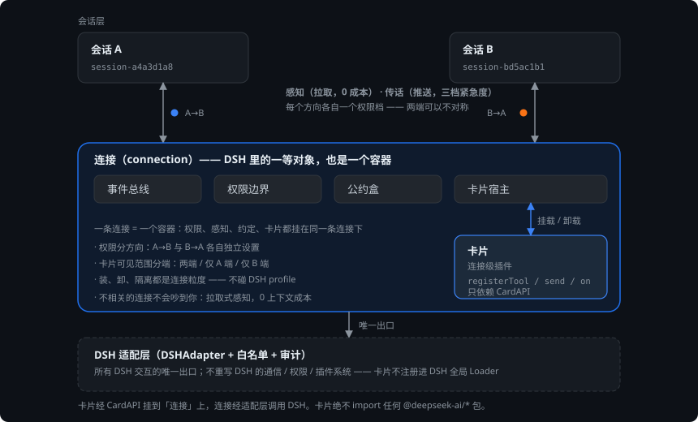
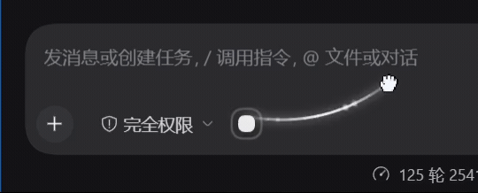
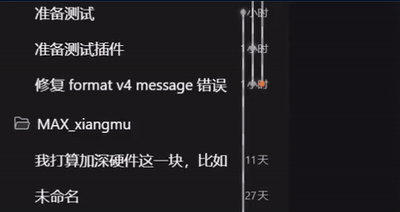
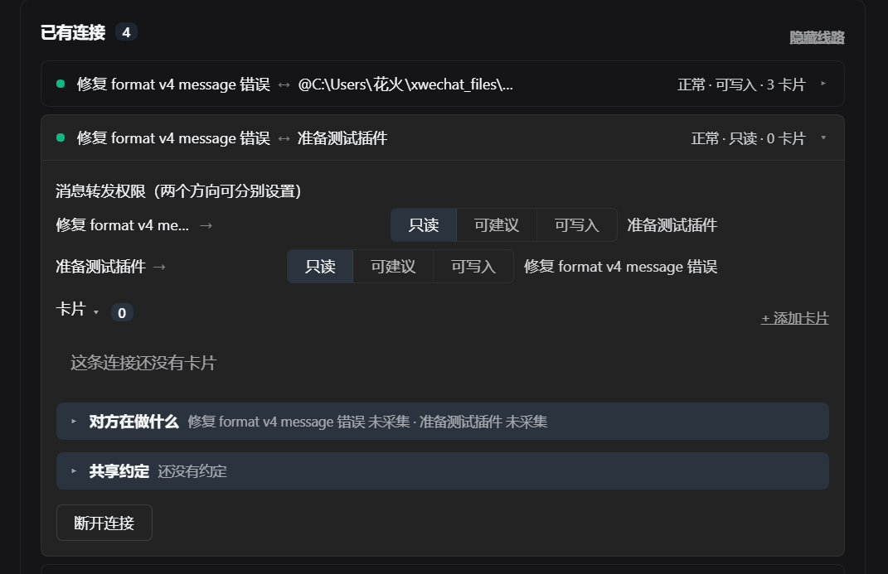
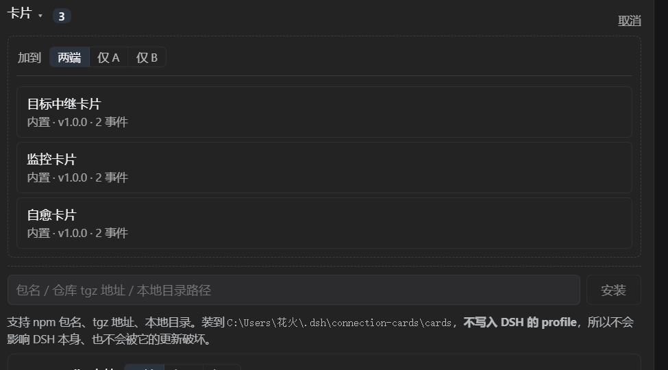
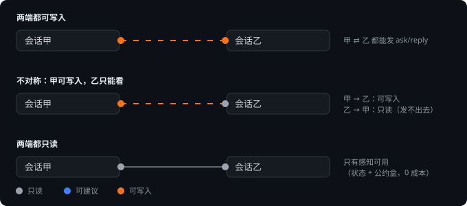

# dsh-connection-card-host

**中文** | [English](README.en.md)

> **把「连接」做成 DSH 里的一等对象：会话是节点，连接是容器，卡片是连接级插件 —— 一个「连接级插件宿主」。**

**为什么是这个插件**：别的插件把能力写死在插件里；这个插件让能力变成「连接上可安装的卡片」——
**装、卸、隔离都是连接粒度**的。

在一个 DSH 里同时开着好几个会话（一个查资料、一个写代码、一个跑实验）是常态。
缺的不是"会话之间能互相看见"这个功能，而是 **DSH 的会话之间可编程的关系层**：
没有一个可以挂东西的"关系对象"，权限边界、共享前提、可装载的能力就都无处安放。

<p align="center">
  
</p>

在这个关系层之上，连接的两端**互相看得见、说得上话、共用得上工具 —— 而互不打扰**。

<table>
<tr>
<td width="50%">

**实际操作**（录屏）



</td>
<td width="50%">

**交互结构**（[架构图](docs/capabilities.md)）



</td>
</tr>
</table>

<p align="center">
  <sub>左：真实操作（<a href="docs/assets/demo-drag-anchor.mp4">原视频</a>） · 右：同一动作的交互结构示意，标出了「开关语义」</sub>
</p>

---

## 目录

- [它能做什么](#它能做什么)
- [三十秒上手](#三十秒上手)
- [三个层次：感知 / 约定 / 传话](#三个层次感知--约定--传话)
- [连接上的卡片](#连接上的卡片)
- [架构速览](#架构速览)
- [为什么这样做](#为什么这样做)
- [省在哪](#省在哪)
- [安装](#安装)
- [卡片开发](#卡片开发)
- [路线图（规划中）](#路线图规划中)

---

## 它能做什么

| | |
|:---|:---|
| **互相看得见** | 查得到对方**正在改哪个文件、计划进行到第几步、最近用了什么工具** —— 自动采集，对方不需要专门告诉你 |
| **说得上话** | 给对端发消息，**紧急度自己判断**：只告知（不打断）／排队／插话／**抢占式中断**（第四档，**默认关闭**） |
| **共用得上工具** | 连接上可以挂**卡片**：卡片能给会话提供工具，甚至带几十 MB 的真依赖 |
| **共用前提** | 「公约盒」存放双方说好的事：接口、单位、命名、分工边界 |
| **互不打扰** | 感知是**拉取式**的 —— 对方不查就零成本；不相关的连接**不会吵到你** |

---

## 三十秒上手

1. **建连接**：按住输入框左侧的圆点（或会话行上的「…」），拖到左侧会话列表里的某一行。

<table>
<tr>
<td width="50%">

**起手式与开关语义**

- 输入框左侧的**圆点** → 拖到某一行
- 会话行上的「**…**」→ 拖到另一行
- 落点即开关：**未连的行 = 连接**；**已连的行 = 断开**（悬停时会提示）
- 也可以从侧栏「连接」面板里选两个会话

</td>
<td width="50%">

**从会话行拖 → 连上之后**（录屏）



</td>
</tr>
</table>

<p align="center">
  <sub><a href="docs/assets/demo-drag-rail.mp4">这段的原视频</a>（锚点拖拽那段的原视频见首屏）</sub>
</p>

2. **完事**。两端各自收到一条静默通知（说清了连上了谁、能做什么），**不打断任何人**。
3. 想看得更细：点侧栏「连接」，或者让会话自己调 `connection_peer_work`。

连接建立后，会话行右侧会出现**竖轨**，两端各一个**彩色圆点** —— 那是该方向的权限：

<p align="center">
  
</p>

---

## 三个层次：感知 / 约定 / 传话

这三层是**分开的**，因为它们的代价差别很大：

| 层 | 机制 | 进对方上下文吗 | 迫使对方行动吗 | 成本 |
|:---|:---|:---|:---|:---|
| **A 工作状态** | 拉取（对端主动查） | 只在它查的时候 | ❌ 不会 | **0** |
| **B 公约盒** | 拉取（对端主动查） | 只在它查的时候 | ❌ 不会 | **0** |
| **C 传话** | 推送（进对方收件箱） | **无条件** | ✅ **必然** | 每条都花 |

**关键事实**：在 DSH 里投递一条消息 = **迫使对方跑一轮**（agent loop 没有"看到但不理"这个状态）。
所以「说话」和「感知」必须分开做 —— 想要对方**知道**，用 A/B；想要对方**做事**，才用 C。

### A. 工作状态（自动，0 成本）

自动从运行事件里采集，**不要求模型额外产出任何东西**：

```
【session-bd5ac1b1】
状态：正在执行命令（2 秒前）
最近动过的文件：water-boat/src/water.js
进度：第 69 轮 / 第 39 步
```

### B. 公约盒（显式，0 成本）

双方说好的标准：接口签名、单位、坐标系、命名、**谁的活归谁**。
面板上可增删；会话用 `connection_conventions` / `connection_declare` 读写。

> **为什么是"拉"不是"推"**：推送会把对方上下文慢慢填满，而大部分时候它用不上。
> 做成"存在盒子里、需要时自己查"，成本就是 0。

### C. 传话（四档紧急度，**由发起方判断**）

| 档位 | 底层 | 对方会怎样 |
|:---|:---|:---|
| `quiet` | `inject` | 放进上下文**但不唤醒** —— 它下次干活时看到，**不被打断** |
| `normal` | `followup` | **排队** —— 处理完手头的事就看到 |
| `urgent` | `steer` | **插话** —— 插进它**正在跑的那一轮**，当场读到 |
| `preempt` | `steer` + 可选 `cancel` | **抢占** —— **打断**它正在跑的这一轮（第四档，**默认关闭**；不满足条件时自动退化为 `urgent`，消息照样送到） |

`urgent` 而对端空闲时**自动降级为排队**（下一轮立刻开始，效果等同即时），不会失败。

> **第四档 `preempt`（抢占式）默认关闭。** 它是破坏性的：被打断的那一轮，已经做的工作白费。
> 开通需要**写权限**（只读连接不能停别人的活），且**每个连接 5 分钟最多 1 次**；
> **对端正在执行工具时绝不打断**（硬红线 —— 跑一半的工具被 cancel 会留下悬空调用）；
> 对端空闲或状态未知时不打断，只投递。任一条件不满足 → **自动退化为 `urgent`，消息照样送到**（永不失败）。
> **旧三档的语义一字未改**：`preempt` 的投递模式与 `urgent` 相同（在跑就插话、空闲就排队），只是多了一次可选的 `cancel`。
>
> 另：`cancel()` 必须带 `keepInbox` —— 它默认**清空收件箱**，会把用户自己排队的输入和别的会话发来的消息一起丢掉。

> **判断原则**（写在工具描述里）：打断是有代价的（对方要中断当前思路）。
> 大部分消息不急 —— 默认 `normal`，只有确实需要它**立刻**改变行为时才 `urgent`。

---

## 连接上的卡片

**卡片 = 挂在连接上、且能分端可见的插件。**

| | DSH 插件 | 卡片 |
|:---|:---|:---|
| 装在哪 | 整个 DSH（profile） | **一条连接** |
| 谁能调 | 所有会话 | **只这条连接上的会话** |
| 可见性 | 全局 | **可分端**：两端 / 仅 A / 仅 B |
| 生命周期 | 随 DSH 起停 | 随连接上的装载卸载 |

<p align="center">
  
</p>

### 卡片能给会话提供工具

卡片里 `api.registerTool(name, fn)` 注册的工具，连接上的会话可以用
**一个**常驻桥接工具按需发现并调用：

```
connection_card_tool                                  ← 唯一常驻的（1 个 schema）
  ├─ 不传 tool → 列出本连接上「对你在的这一端可见」的卡片与工具
  └─ 传 tool   → 调用它
```

**为什么是一个桥接、而不是每个工具各占一个 schema**：后者会让**每个会话**都为
每个卡片工具付常驻成本，而卡片是随连接动态装载的。桥接只占 1 个，
而且天然能在桥接层强制可见范围。

**可见范围真的拦得住**（实测）：

```
A 端可见该卡片        ✅
B 端看不到            ✅
B 端硬调它 → 拒绝     「这张卡片只对 A 端可见（你在 B 端）」
```

### 卡片里可以塞真依赖

实测：把社区插件 `dsh-pdf` 的解析核 + **pdfjs-dist（33 MB）** 包成一张卡片，
装到 `$DSH_HOME/connection-cards/cards/`，**不碰 DSH profile**。
会话通过桥接调用，拿回真实解析结果。

### 面板内安装与更新

<p align="center">
  
</p>

- **装**：包名 / 仓库 tgz 地址 / 本地目录 → 装进我们自己的目录，**不跑 pnpm、不改 profile**
- **更新**：已安装的卡片带「检查更新」入口，三态分列
  ```
  「检查更新」→「↑ 更新到 x.y.z」/「已是最新」/「无法检查」
  ```
  **"无法检查"绝不显示成"已是最新"** —— 那是谎报。

### 声明：第三方 / 社区卡片可以直接下载安装，装完即用

**可以在内部直接下载安装外部 DSH 会话相关的插件卡片，并立即使用。**

这不是"官方卡片市场"，也不是一个需要审核上架的中心 —— 它是**开放的分发**：
任何按[卡片协议](docs/card-protocol.md)写出来的包，都能从下面三种来源装进你自己的 DSH。

| 来源 | 给什么 | 实现 |
|:---|:---|:---|
| **包名**（注册表） | `monitor-card` / `@scope/monitor-card` | 从 registry 拉 **tarball**（一次 HTTPS GET） |
| **仓库 tgz 地址** | `https://example.com/card.tgz` | 下载后解压 |
| **本地目录** | `D:\my-cards\monitor-card` | 直接拷贝 |

（与连接面板里**卡片选择器**的三种来源一致。）

**装完即可用** —— 卡片装到一条连接上之后：

- 连接上的会话**立刻**能用它提供的工具（经 `connection_card_tool` 桥接调用）——
  **不需要重启 DSH，不需要改 DSH 配置**：不跑 pnpm、不写 `dsh.profile.bundles`
- 卡片装在自己的目录 `$DSH_HOME/connection-cards/cards/<id>/`，与 DSH profile 完全隔离

**三条边界**（是设计，不是"限制"）：

| 边界 | 含义 |
|:---|:---|
| **分端可见** | 可见范围分端：两端 / 仅 A 端 / 仅 B 端。**A 端可见 ≠ B 端可见**；不可见的一端硬调会被拒绝，并说明原因 |
| **版本门控** | DSH 版本不匹配会被**明确拒绝并说明原因**，而不是装上再崩。卡片另有一条 CardAPI 版本护栏（要更高版本的卡片会被拒绝装载并说明原因） |
| **崩溃隔离** | 卡片 import / apply 抛异常不会拖垮宿主 |

> 第三方 / 社区卡片与 DSH 官方项目**没有隶属关系**；本插件不提供审核、背书，
> 也不存在"官方目录"这种东西。

---

## 架构速览

三层，边界很硬 —— 每层只跟下一层说话：

```
┌─────────────────────────────────────────────────────────────┐
│  卡片层（连接级插件）                                        │
│  只依赖 CardAPI，绝不 import @deepseek-ai/*                  │
│  → DSH 升级不影响卡片；我们改 CardAPI 才影响（有版本护栏）    │
├─────────────────────────────────────────────────────────────┤
│  连接层（本插件）                                            │
│  连接 / 权限 / 感知 / 公约盒 / 卡片宿主 / 消息投递            │
│  → DSH 升级时，只需要改这一层                                 │
├─────────────────────────────────────────────────────────────┤
│  DSH 适配层（DSHAdapter + 白名单 + 审计）                    │
│  所有 DSH 交互的唯一出口；不重写 DSH 的通信/权限/插件系统      │
└─────────────────────────────────────────────────────────────┘
```

### 权限是**分方向**的

一根线两端各一个圆点，颜色是**那个方向**的权限 —— 两个方向互不影响，
可以做成「甲能发、乙只能看」：

<p align="center">
  
</p>

**只读不影响感知**：工作状态与公约盒都是对端**主动查询**的，与权限无关。
降低权限立即生效；提高权限需要被授权的一方确认。

### 卡片工具怎么到会话手里

卡片注册的工具**不各占一个 schema** —— 会话只看得见**一个**常驻桥接，
按需发现、按需调用，且在桥接层强制可见范围（图见[连接上的卡片](#连接上的卡片)）。

---

## 为什么这样做

### 1. 不重写 DSH

不碰 DSH 的通信、权限、插件系统；卡片**不注册到 DSH 全局 Loader**。
所有 DSH 交互走中间适配层，DSH 升级时**只需要改这个插件**。

### 2. 双向自动镜像 —— 我们把它关掉了

早期版本会自动把会话内容转发给对方。**实测下来这是错的**，三次事故：

1. 用户给 A 下的指令被镜像给 B → **B 当成自己的任务去做**
2. 助手的汇报被镜像 → 对端当成用户指令去响应
3. 助手对用户说的旁白被镜像 → 对端显示「收到执行请求」并**真的跑了一轮**

对端的量化：**30 条 / 12,765 字的镜像占它会话"用户侧字符"的 77.8%，其中没有一条产生了有用动作。**

**所以默认不自动转发任何东西。** 跨会话传话走显式发送，感知走 A/B 两层。

### 3. 打断是要花钱的

旧实现的投递策略是"对端在跑就插话"—— 等价于**每条消息都是最高优先级**。
现在紧急度由发起方判断，默认排队；第四档 `preempt`（抢占式，会**打断**对方正在跑的一轮）**默认关闭**，开通需写权限、每连接 5 分钟 1 次。

### 4. 连线挂在 `body` 层级 —— 与槽位解耦的取舍

两条线（轨道线、拖拽线）**不用槽位容器渲染**，而是挂在一个**专用宿主**上 ——
该宿主是 `document.body` 的**最后一个子节点**，自带接近上限的 `z-index`。

**为什么非这样不可**：`z-index` **只在同一个堆叠上下文（stacking context）里可比**。
插件各槽位渲染在 DSH 不同的容器里，容器不同就是堆叠上下文不同 ——
别人（皮肤 / 叠加层）只要把**自己那个容器**排在我们容器之上，
我们**元素自身**的 `z-index` 抬到多高都赢不了；
皮肤若再用 `transform` / `filter` / `will-change`，还会造出新的堆叠上下文，任何 `z-index` 都可能失效。
实测现场：装 `web-ui-skin-center` 时"看不见线"，关掉就正常 —— 轨道线与拖拽线**各自都栽过一次**。

**代价（如实）**：宿主**永远在 `body` 层级**，所以将来若有"必须最上层"的全屏模态，
这两条线会**画在模态之上**。当前靠 `pointer-events: none` 保证不挡交互，风险低。

**要收的话建议做最小判据**：检测到 `[role="dialog"][aria-modal="true"]` 时把轨道压到模态之下，
模态关闭即恢复 —— **不是**无条件降级隐藏。

---

## 省在哪

| 项 | 数字 | 说明 |
|:---|:---|:---|
| **感知（A + B 两层）** | **0 上下文** | 拉取式；对端不查就不产生任何成本 |
| **卡片工具** | **1 个常驻 schema** | 而不是每个卡片工具各占一个 |
| **自动镜像** | **0（已关闭）** | 关闭前实测 77.8% 是无用内容 |
| **不相关的连接** | **0 打扰** | 搭线不唤醒；不相关的会话照常干活 |

**唯一固定成本**：本插件 5 个 `connection_*` 工具的 schema ≈ **1700 tokens 常驻**。
（这一项还可以再优化 —— 见[路线图](#路线图规划中)。）

---

## 安装

**npm（推荐，可锁版本）**：

```sh
dsh plugin --profile web add @noob-stupid/dsh-connection-card-host
```

**GitHub 直装**（装**默认分支最新提交**，不是固定版本）：

```sh
dsh plugin --profile web add github:Noob-stupid/dsh-connection-card-host

# 同上，GitHub 简写（可省 github:）—— 带斜杠就走 GitHub 仓库
dsh plugin --profile web add Noob-stupid/dsh-connection-card-host
```

**固定版本：用 Releases 的 tgz 附件**（当前最新 v1.0.17）：

```sh
dsh plugin --profile web add https://github.com/Noob-stupid/dsh-connection-card-host/releases/download/v1.0.17/noob-stupid-dsh-connection-card-host-1.0.17.tgz

# 同一份 tgz 先下载到本地再装，效果相同
dsh plugin --profile web add ./noob-stupid-dsh-connection-card-host-1.0.17.tgz
```

- 开发发生在**预览线仓库** [`dsh-connection-card-host-preview`](https://github.com/Noob-stupid/dsh-connection-card-host-preview)；
  **本仓库是稳定门面**，只在发版时按晋级流程同步。
- `lib/` 已随仓库提交（npm 包里也带上）：装完即可用，不需要构建步骤，
  本包也没有需要授权的构建脚本。（`dsh plugin` 依赖 `pnpm` 在 PATH 上。）
- ⚠️ `github:` 与简写装的是**默认分支的最新提交**，**不是固定版本**；
  要固定版本请用 npm 的版本号（`@noob-stupid/dsh-connection-card-host@1.0.17`）或上面的 Releases tgz。

> 实测（pnpm 9.15.9 + profile 同款配置）：npm 包名安装**只增加 1 个包**，落 `lib/` 170 个文件，
> **不会**把 `@deepseek-ai/*` 依赖拖进你的 profile。

**兼容性**：`peerDependencies` 声明 `@deepseek-ai/dsh >=0.2.0-rc.1 <0.3.0`
（另有 `@deepseek-ai/cordis` 与两个 `@deepseek-ai/dsh-client-*`）——
DSH 会在安装时**按版本门控**，不匹配会明确拒绝并说明原因（而不是装上再崩）。

这四个 peer 都标了 `peerDependenciesMeta.optional`。原因有两条，都实测过：

- `@deepseek-ai/dsh-client-runtime` 在公开 registry 上**没有**满足区间的版本
  （最高停在 `0.1.1-rc.2`）—— 不标 optional，pnpm 直接 `ERR_PNPM_NO_MATCHING_VERSION`，**装不上**；
- 只标那一个也不行：pnpm 会把**整棵 `@deepseek-ai/dsh` 依赖树（602 个包）**装进你的 profile
  （实测 1 分 36 秒），而那正是 `autoInstallPeers: false` 要避免的事。

本包**运行时一个 `@deepseek-ai/*` 都不 import**（`lib/` 全树无命中；浏览器端那两个包由 DSH 的
`__ModuleLoader__` 注入），所以"声明契约、不强制安装"才是准确的表达。标 optional
**不改门控** —— DSH 的 `evaluatePluginCompatibility` 只读 `peerDependencies`。
细节见 [`docs/compatibility.md`](docs/compatibility.md)。

---

## 卡片开发

一张卡片就是一个带 `dshCard` 清单的 npm 包：

```json
{
  "name": "my-card",
  "version": "1.0.0",
  "main": "index.js",
  "dshCard": { "id": "my-card", "name": "我的卡片", "entry": "index.js", "api": 1 }
}
```

```js
// index.js —— ⚠️ 绝不 import 任何 @deepseek-ai/*，所有交互走 api
export function apply(api) {
  api.log(`已装载（scope=${api.scope}）`)

  // 给连接上的会话提供工具
  api.registerTool('greet', async (args) => {
    return `你好，${args?.name ?? '世界'}`
  })
}

// 面板 HTML（可选）
export function renderPanel(api) {
  return `<div>可见范围：${api.scope}</div>`
}
```

| `api` 成员 | 说明 |
|:---|:---|
| `registerTool(name, fn)` | 注册工具 → 会话经 `connection_card_tool` 调用 |
| `send(kind, text)` / `read()` | 以某一端身份收发连接消息 |
| `on(event, handler)` / `emit(event, data)` | 连接级事件 |
| `scope` | 本实例作用在哪一端（`both` / `a` / `b`） |
| `log(...)` | 写宿主日志 |

**`dshCard.api`** 是卡片声明自己需要的 **CardAPI 版本**（缺省 1）：

- **加东西不升版本** —— 老卡片照常跑
- **删或改语义才升版本** —— 宿主会拒绝装载要更高版本的卡片，并说明原因

> 这是**我们自己的兼容性护栏**：卡片不依赖 DSH 内部包，所以 DSH 升级不影响卡片；
> 但**我们改 `CardAPI` 会影响卡片**，而 DSH 的版本门控管不到这一层。

细节见 [`docs/card-protocol.md`](docs/card-protocol.md)。

---

## 路线图（规划中）

**当前版本能做什么**（已实现并实测）

- 连接：拖拽建连（开关语义）、三会话两两相连、持久化 + 重启恢复
- 权限：分方向三档、不对称、升级需对方确认、拒绝原因自证
- 感知 A：自动采集工作状态（0 上下文）
- 共识 B：公约盒（0 上下文）
- 传话 C：四档紧急度（第四档 `preempt` 抢占式，**默认关闭**）+ 自动降级
- 卡片：模板发现 / 装载 / 按端可见 / 面板内安装 / **更新** / 崩溃隔离
- 卡片工具：桥接调用 + 可见范围强制
- 卡片目录**版本化**（装载中也能更新）

**规划中**（下面几项**尚未实现**，接口已就位、实现待补）

| 项 | 现状 | v1.1 目标 |
|:---|:---|:---|
| **工具按会话 scope** | 5 个 `connection_*` 目前**全局注册** —— 没连接的会话也背着 ~1700 tokens。接缝已定位（`system-prompt/assemble` waterfall），差注册写法 | 只对参与连接的会话注册，省掉这笔常驻成本 |
| `mountUI` | 接口已就位、实现待补：目前只设了一个 dataset 属性 | 浏览器侧真实挂载 DOM |
| `requestRemote` | 接口已就位、实现待补：宿主无 `ctx.remote`，调用返回 `not_available` | 按对端白名单做远程调用 + 审计 |
| 卡片面板浏览器侧执行 | 未实现（面板 HTML 在宿主侧渲染后取回） | 视需要评估 |

> 卡片工具的 schema **有意不各占一个**：调用方需先 list 再 call。
> 这是成本与可见范围的取舍，不是待办。

**已知坑：改完代码后"测试全绿但用户看到旧行为"**

这个坑会**反复**发生，而且现象很像"功能坏了"，所以单独写出来：

| 半边 | 什么时候才装载新代码 |
|:---|:---|
| **宿主半边**（`lib/index.js` 等） | 改完 `lib/` 对**已运行的进程无效** —— 必须**重启 DSH 或热重载插件**。否则面板里跑的还是旧代码（真实撞过：用户点安装报的还是最初那版的 `fetch failed`，而代码早就修好了） |
| **客户端半边**（`lib/client.js`） | 即使宿主重载了，浏览器**还要刷新页面**才装载新包（本实例 `client-hmr` 是 active 的，但用户不刷新就看不到新行为） |

**排查口诀**：先看报错**长什么样**。旧代码的报错往往是**光秃秃一句**（`fetch failed`），
新代码的报错会**列出通道、字节数、归因**。一眼就能分辨跑的是哪一版。

同类误读还有一个（不是本插件的问题，但对端同结论）：**对端会话离线时**，
连接消息会走冷唤醒通道落地成普通消息、**没有卡片壳** —— 见下面那条「已知差异」。

**已知差异：连接消息在"对端离线"时没有卡片壳**（不是故障，是投递通道差异）
同一套机制，两种落点：

| 对端状态 | 投递通道 | 界面表现 |
|:---|:---|:---|
| **在线** | `agents.followup` → 代理收件箱 | **折叠卡**（带状态行、可展开） |
| **不在线** | 冷唤醒兜底 `sessionController.prompt` | **普通消息**（没有卡片壳） |

后者由框架渲染成一条普通用户消息，**投递方控制不了它的外观**。所以我们在**内容开头加了标识**
（`COLD_DELIVERY_PREFIX`）：

```
📨 【连接消息】
> 对方会话当时**不在线**，这条以普通消息送达（连接卡片本身没坏）。
> 会话在线时，同样的消息会显示为带状态的卡片。
```

看到这段就说明"卡片没事，只是对端当时不在线"。标识加在 `content` 上（那段是我们自己拼的），
**不需要发送方配合**改任何字段。


---

## 文档

| 文档 | 内容 |
|:---|:---|
| [`docs/capabilities.md`](docs/capabilities.md) | **能力报告**：逐项实测结果、上下文成本总账、已知限制 |
| [`docs/card-protocol.md`](docs/card-protocol.md) | 卡片协议：清单、CardAPI、安装校验、分发来源 |
| [`docs/compatibility.md`](docs/compatibility.md) | 兼容性：DSH 版本门控机制、两条防线 |
| [`docs/adapter-api.md`](docs/adapter-api.md) | DSH 适配层：稳定接口与白名单 |

---

<p align="center">
  <sub>BSD-3-Clause · 与 DSH 官方无隶属关系</sub>
</p>
